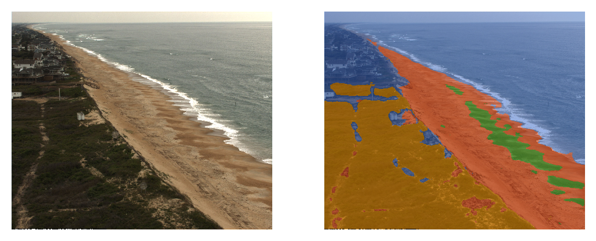

# Segmentation of ARGUS images to investigate grain size at the FRF (Duck, NC, USA). 

Example model output from FRF ARGUS c1 (north-facing camera): orange is  vegetation, red is beach sand, green is coarse sediment/shell hash, blue is background (water, buildings, sky, people)

### Training Data:
Made with [Doodler](https://github.com/Doodleverse/dash_doodler) - *link to training data coming soon*

### Deep learning model:
Made with [Segmentation Gym](https://github.com/Doodleverse/segmentation_gym) - *link to model coming soon*

### Predictions:
Made with the segmentation model and many years of FRF Argus imagery - *link to model output coming soon*

### HuggingFace Spaces Demo App:

[DEMO app](https://huggingface.co/spaces/ebgoldstein/FRFArgus)